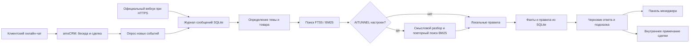

# Помощник менеджера для amoCRM

Сервис принимает сообщение покупателя из онлайн-чата amoCRM и готовит два отдельных блока:

1. **Ответ клиенту** — вежливый черновик на основе подтверждённых сведений из базы знаний.
2. **Подсказка менеджеру** — возможная допродажа с объяснением и уточняющим вопросом либо указание, что оснований для неё пока нет.

Черновик автоматически появляется как **внутреннее примечание в сделке amoCRM** и в локальной панели. Менеджер проверяет сведения и сам отправляет ответ клиенту. Сам сервис клиенту ничего не пишет.

> **Данные учебные.** Товары, цены, остатки и сроки доставки в поставляемой базе вымышлены. Перед работой с настоящими покупателями замените их проверенными данными компании.

## Быстрый запуск без аккаунта amoCRM

Нужны Python 3.11+ и доступ к сети для установки зависимостей. Команды рассчитаны на Linux/macOS; в Windows активируйте виртуальное окружение способом вашей оболочки.

```bash
git clone https://github.com/artemius125/amo-crm-sales-assistant.git
cd amo-crm-sales-assistant
python -m venv .venv
source .venv/bin/activate
pip install -e .
amo-assistant init-db
amo-assistant doctor
amo-assistant serve
```

Откройте `http://127.0.0.1:8765/`. Это локальная панель менеджера. В поле обращения напишите, например, «Сколько стоит ноутбук и какая на него гарантия?» и нажмите **«Подготовить ответ»**. Кнопка **«Создать демо-сообщение»** проводит текст через локальный журнал входящих и тот же обработчик, который обслуживает amoCRM. Такое демо-сообщение **не создаёт сделку в amoCRM**.

Без `LLM_API_KEY` сервис работает по локальным правилам и не вызывает внешнюю модель. Для этого режима не нужны токены amoCRM или AITUNNEL. Если сервис запускается второй раз, база в `.data/knowledge.sqlite3` сохраняется. `init-db` создаёт недостающие учебные записи через `INSERT OR IGNORE` и не перезаписывает уже изменённые значения.

### Примеры для локальной панели

| Обращение | Что ожидать |
| --- | --- |
| «Сколько стоит ноутбук и какая гарантия?» | Цена и гарантия из SQLite; без навязчивой допродажи. |
| «Есть ноутбуки для работы с таблицами?» | Подбор или наличие основного товара; фраза сама по себе не подтверждает потребность в мониторе. |
| «Нужен ноутбук, одновременно держу открытыми много таблиц» | Возможный монитор в подсказке; менеджер уточняет потребность и проверяет условия. |
| «Сколько везёте заказ в Казань?» | Условие доставки по России, даже без слова «Россия». |
| «Ноутбук сломался, хочу вернуть деньги» | Сценарий обращения по возврату; допродажа отключена. |
| «Продаёте игровые кресла?» | Сервис не выдумывает отсутствующий в базе товар. |

Для продолжения беседы используйте один код демонстрационной беседы: сначала «Нужен ноутбук», затем «А какая гарантия?». Сервис возьмёт однозначно названный товар из предыдущего входящего сообщения. Кнопка «Новая беседа» создаёт другой код.

## Путь сообщения от клиента к менеджеру



### 1. Получение и сохранение сообщения

В текущем тестовом аккаунте включён `AMO_POLLING=true`. Каждые три секунды сервис запрашивает новые события типа `incoming_chat_message` через API amoCRM. Для события сделки он получает текст сообщения из истории сделки, сохраняет ID сообщения, ID беседы, ID сделки и текст в `.data/assistant.sqlite3`. Повторная обработка того же ID не создаёт вторую запись или второе примечание. Сервис просматривает события с перекрытием по времени, чтобы пережить краткие задержки.

Есть и маршрут `POST /webhooks/amo/{secret}` для официального вебхука `add_message`: он принимает JSON или данные формы, проверяет секрет, отсекает сообщения не от внешнего клиента и передаёт запись тому же обработчику. Для работы вебхука нужен постоянный публичный HTTPS адрес. При использовании опроса публичный адрес не требуется.

**Важное ограничение опроса:** список событий — официальный API, но текст сообщения сейчас читается через `GET /ajax/v3/leads/{id}/events_timeline`, endpoint интерфейса amoCRM без публичного контракта. amoCRM может его изменить. При большом потоке сообщений нужно также заменить опрос и очередь процесса на надёжную доставку вебхуков с постоянным хранилищем задач.

### 2. Определение вопроса и контекста

Сообщение ограничивается 5000 символами, пробелы нормализуются. Локальные правила распознают темы вроде цены, наличия, гарантии, оплаты и доставки. Жалобы, возвраты и вопросы о здоровье выделены отдельно: подсказка о продаже для них выключается. Вопрос «есть что-нибудь подходящее?» считается запросом на подбор, а не требованием назвать остаток.

Названия товаров и их варианты берутся из таблицы `product_aliases`, а не зашиваются в обработчик. Если товар не назван в коротком продолжении, сервис просматривает до пяти недавних входящих реплик той же беседы за 24 часа. Он берёт товар из контекста только при однозначном совпадении и показывает менеджеру соответствующее предупреждение. Исходящие сообщения менеджера этот прототип в контекст не включает.

### 3. Поиск BM25 и границы для AI

`documents` хранит короткие описания товаров и условий. При запуске сервис строит из них индекс SQLite FTS5 в памяти. Русские слова нормализуются стеммером Snowball, а документы ранжируются функцией BM25. Начальная выдача помогает понять, какие документы подходят сообщению. Конкретные цифры и условия для ответа выбираются из таблицы `facts` только при наличии подходящего документа в выдаче.

Если задан `LLM_API_KEY`, AITUNNEL получает сообщение, несколько предыдущих реплик, кандидатов BM25, каталог и допустимые правила. Модель возвращает структурированный разбор и более точный поисковый запрос. После этого **выполняется второй поиск BM25**. Модель не пишет окончательный ответ и не становится источником цены, срока, гарантии или наличия. Сервер принимает только известные ID товаров и правил, проверяет цитату потребности по текущему сообщению и собирает ответ из SQLite. Если модель недоступна или отвечает дольше 15 секунд, применяется локальная логика.

### 4. Сборка ответа клиенту

Каждый `fact` имеет категорию, значение, документ-источник и признак изменчивости. Например, цена и остаток помечены как изменчивые: в черновике появляется просьба проверить актуальность перед подтверждением заказа. Если точного сведения нет, сервис задаёт уточняющий вопрос или обещает проверить условия; он не подставляет придуманную цифру. Когда товара нет в учебном каталоге, ответ не утверждает, что он продаётся.

### 5. Выбор подсказки о допродаже

`upsell_rules` связывает основной товар с дополнением, объяснением, вопросом менеджера и признаками подходящей задачи. Для рекомендации нужны **однозначный товар и основание из текущего обращения**. Например, одно лишь «ноутбук для таблиц» не означает, что покупателю нужен монитор. «Постоянно переключаюсь между несколькими окнами» описывает конкретное неудобство, при котором менеджер может спросить о втором экране. AITUNNEL может предложить связь без буквального триггера, но обязан вернуть цитату из текущего сообщения; сервер отбрасывает необоснованную рекомендацию.

Если основания нет, менеджеру предлагают уточнить сценарий использования **без названия дополнения**. Это предотвращает повтор одной и той же подсказки в каждой реплике беседы. Подсказка с дополнением остаётся гипотезой: менеджер проверяет совместимость, актуальную цену и наличие до предложения клиенту.

### 6. Отображение и отправка

В локальной панели `/` входящие обновляются каждые пять секунд. Новое обращение выбирается автоматически; пока оно обрабатывается, панель не показывает ответ от старой беседы. Видны клиентский черновик, внутренняя подсказка, источники, результаты BM25, полный состав учебной базы и журнал выбранной беседы. При наличии `AMO_DOMAIN`, `AMO_TOKEN` и `PUBLISH_NOTES=true` оба блока публикуются через `POST /api/v4/leads/{id}/notes` как внутреннее примечание. Оно не является сообщением клиенту. Менеджер открывает сделку, проверяет черновик и отправляет ответ сам.

## База знаний: что менять и где

Исходная схема и учебное наполнение находятся в [knowledge/demo.sql](knowledge/demo.sql). После `init-db` рабочая база лежит в `.data/knowledge.sqlite3`. Она является источником правды; индекс BM25 строится из неё и может быть восстановлен.

| Таблица | Содержимое | Как влияет на результат |
| --- | --- | --- |
| `documents` | Описание, вид документа, источник, дата проверки, ID товара | Поиск BM25 выбирает подходящий документ. |
| `product_aliases` | Обычные и торговые названия товара | Помогает понять слова клиента без точного артикула. |
| `facts` | Цена, остаток, гарантия, разъёмы, доставка, оплата и другие значения | Только отсюда берутся конкретные условия в ответ. |
| `upsell_rules` | Основной товар, дополнение, причина, вопрос, триггеры, приоритет, активность | Определяет допустимые сценарии допродажи. |

Учебная база содержит 8 документов, 16 атомарных фактов, 9 алиасов и 2 правила. Такого объёма достаточно для проверки алгоритма; искусственно наращивать каталог до сотни дубликатов ради векторной базы не требуется. Для другой компании замените учебные записи реальными товарами и политиками, укажите проверяемые `source` и `reviewed_at`, настройте алиасы и правила под задачи клиентов.

Пример изменения цены в своей локальной SQLite:

```bash
python - <<'PY'
import sqlite3
with sqlite3.connect('.data/knowledge.sqlite3') as db:
    db.execute("UPDATE facts SET value=? WHERE id=?", ('61 900 ₽ за штуку', 'laptop-price'))
PY
```

Факты и правила читаются из SQLite при обращении. Если меняете `documents` или `product_aliases`, перезапустите сервис: они загружаются при старте, а индекс FTS5 пересобирается. `init-db` не служит инструментом миграции уже изменённой рабочей базы: для новых правил применяйте SQL к своему файлу БД или создайте его заново из обновлённого шаблона.

## Включение AITUNNEL

AITUNNEL необязателен. Создайте рядом с проектом `.env.local` и не добавляйте его в Git:

```bash
LLM_API_KEY=ваш_ключ
LLM_MODEL=gpt-4o-mini
```

Запустите сервис, загрузив переменные в оболочку:

```bash
set -a
source .env.local
set +a
amo-assistant serve
```

`LLM_API_KEY` хранится только на сервере. Панель показывает результат структурированного разбора, но не ключ. Вызов модели расходует баланс AITUNNEL. Без ключа сервис продолжает работать: факты, BM25, локальные правила и демо-панель доступны. Модель должна поддерживать используемый API структурированного JSON; при несовместимом ответе срабатывает локальный режим.

## Подключение собственного amoCRM

Для подключения к другому аккаунту amoCRM понадобятся его собственная приватная интеграция с доступом к API и онлайн-чат. Чужие токены для развёртывания не нужны. Значения для `.env.local` перечислены ниже; исходный шаблон — [.env.example](.env.example).

| Переменная | Назначение |
| --- | --- |
| `KNOWLEDGE_DB_PATH` | Рабочая SQLite с документами и фактами; по умолчанию `.data/knowledge.sqlite3`. |
| `DATABASE_PATH` | SQLite журнала сообщений; по умолчанию `.data/assistant.sqlite3`. |
| `AMO_DOMAIN` | Домен своего аккаунта, например `example.amocrm.ru`. |
| `AMO_TOKEN` | Токен своей приватной интеграции с доступом к сделкам и примечаниям. |
| `AMO_ACCOUNT_ID` | Дополнительная проверка аккаунта для вебхука. |
| `AMO_POLLING` | `true` включает проверку новых сообщений каждые три секунды. |
| `PUBLISH_NOTES` | `true` разрешает публикацию внутреннего примечания в сделке. |
| `AMO_WIDGET_ID`, `AMO_WIDGET_HASH` | Параметры своего виджета онлайн-чата для страницы `/client`. |
| `WEBHOOK_SECRET` | Длинный случайный секрет в пути вебхука. |
| `APP_API_KEY` | Ключ панели и API при удалённом доступе. |
| `LLM_API_KEY`, `LLM_MODEL` | Необязательные ключ и модель AITUNNEL. |

Для локального показа через опрос установите `AMO_DOMAIN`, `AMO_TOKEN`, `AMO_POLLING=true`, `PUBLISH_NOTES=true`, `AMO_WIDGET_ID` и `AMO_WIDGET_HASH`. Запустите `amo-assistant serve --host 127.0.0.1 --port 8787`. Тогда `/client` содержит виджет **вашего** аккаунта, а `/` — панель менеджера. Клиентская страница создаёт новый UUID посетителя для каждого нового окна через конфигурацию онлайн-чата. Первое сообщение такого посетителя должно открыть новую беседу и сделку в вашем аккаунте. Подсказка появляется после получения сообщения и обработки, а не в момент набора текста.

Для вебхука вместо опроса настройте постоянный публичный HTTPS адрес сервиса и событие `add_message` с URL `https://ваш-домен/webhooks/amo/ваш-секрет`. Если сообщение пришло без ID сделки, запись будет видна в панели, но примечание в сделку добавить нельзя. Если публикация примечания завершилась ошибкой, в журнале остаётся черновик со статусом «Нужна проверка».

Локальные запросы к панели и `/api/*` доступны с `127.0.0.1` без ввода ключа. При публикации на внешнем интерфейсе CLI требует `APP_API_KEY`, а сетевые клиенты должны передавать `Authorization: Bearer ...`. Не публикуйте `.env.local`, `.data/` и профиль браузера: они могут содержать токены и клиентские сообщения.

## HTTP API и файлы проекта

| Метод | Путь | Что возвращает или делает |
| --- | --- | --- |
| `GET` | `/health` | Состояние, число документов, флаги подключения. |
| `GET` | `/` | Панель менеджера. |
| `GET` | `/client` | Страница клиента с виджетом и новым диалогом. |
| `POST` | `/api/suggest` | Два блока по `{"message":"..."}` без записи в журнал. |
| `POST` | `/api/demo-message` | Учебное входящее через журнал и обработчик. |
| `GET` | `/api/inbox` | Последние сообщения, статусы и подсказки. |
| `GET` | `/api/inbox/{id}` | Одно сообщение. |
| `GET` | `/api/inbox/{id}/conversation` | Недавняя беседа выбранного сообщения. |
| `GET` | `/api/knowledge` | Документы, факты, алиасы и правила. |
| `POST` | `/webhooks/amo/{secret}` | Входящее событие amoCRM. |

| Файл | За что отвечает |
| --- | --- |
| `src/sales_assistant/retrieval.py` | Чтение SQLite, стемминг, FTS5/BM25, поиск фактов и товаров. |
| `src/sales_assistant/suggestions.py` | Определение темы, составление ответа и подсказки. |
| `src/sales_assistant/ai.py` | Необязательный структурированный разбор через AITUNNEL. |
| `src/sales_assistant/poller.py` | Опрос событий amoCRM и получение текста сообщения. |
| `src/sales_assistant/amo.py` | Разбор вебхука и публикация внутреннего примечания. |
| `src/sales_assistant/store.py` | Журнал сообщений и статусов. |
| `src/sales_assistant/api.py` | API, автоматическая обработка и HTML-страницы. |
| `src/sales_assistant/web/` | Панель менеджера и клиентская страница. |
| `src/sales_assistant/config.py`, `cli.py` | Переменные окружения и команды запуска. |
| `knowledge/demo.sql` | Схема и воспроизводимая учебная база. |

## Что проверено и что остаётся ограничением

На тестовом аккаунте проверялись отдельные реальные беседы через клиентский онлайн-чат: подбор ноутбука, большой экран, возврат, доставка в регион, товар вне каталога и сценарии с подтверждённой/неподтверждённой допродажей. В новых клиентских окнах появились разные сделки; сервис сам добавил примечания. Локальная панель также получила эти сообщения и автоматически показала последний черновик. Playwright использовался для проверки браузера, а не для работы сервиса после запуска.

В поставляемой базе нет живых складских остатков и актуального каталога; совместимость дополнения задаётся правилом, а не проверяется по матрице характеристик. Сервис видит только входящие реплики, поэтому сложные смены темы и отрицания могут требовать ручной проверки. Опрос amoCRM зависит от неофициального endpoint и ограничен размером выдачи событий. Очередь работает внутри процесса FastAPI: при остановке посередине обработки потребуется ручное восстановление. Для эксплуатации нужны официальный вебхук, постоянный HTTPS адрес, устойчивые повторы задач, мониторинг, ограничение прав токенов и политика хранения клиентских данных.

**Ссылки на API amoCRM:** [события вебхуков](https://www.amocrm.ru/developers/content/crm_platform/webhooks-api), [формат вебхуков](https://new.amocrm.ru/developers/content/crm_platform/webhooks-format), [примечания сделки](https://www.amocrm.ru/developers/content/crm_platform/events-and-notes).
